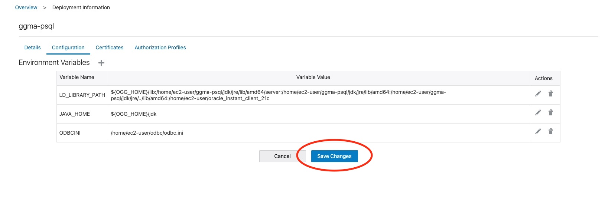

# Replicación bidireccional con GoldenGate Microservices

<br/>

## Requisitos

Para poder ejecutar este ejemplo necesitas;

- Docker
- Credenciales de consola de un usuario de AWS con permiso para manejar EC2, RDS Oracle, MSK, VPC, Security Groups

<br/><br/>

## Creando la infraestructura base

### Infraestructura en AWS

Para facilitar la “puesta en escena” del caso de uso vamos a usar los servicios de bases de datos gestionadas (RDS) para disponer de una base de datos Oracle y una base de datos Postgresql. 

La base de datos Oracle, en un caso real, podría estar en un entorno on-premise. En el caso de uso, sí se comenta que uno de los objetivos es ir a una base de datos en Cloud y autogestionada.

En este caso de ejemplo, como queremos facilitar la conexión a los diferentes elementos directamente desde el PC local, hemos definido una VPC con una única subred pública y dotaremos a las bases de datos de acceso público. En un sistema productivo, usaríamos redes privadas. 

A continuación vamos a detallar los pasos a seguir

<br/>

#### Generando la clave SSH

El script de Terraform necesita un par de claves para crear las instancias EC2 y nosotros usaremos la clave SSH posteriomente para conectarnos a las instancias. 

Por tanto, antes de lanzar el script de Terraform vamos a generar un par de claves ejecutando el siguiente comando desde la raíz del proyecto:

```bash
ssh-keygen -q -N "" -f iac/ssh/ssh_gg
```

Dentro del directorio “iac/ssh” se crearán dos ficheros correspondientes a las claves pública y privada.

<br/>

#### Creando la infraestructura con Terraform

Para ejecutar las acciones de creación y destrucción de la infraestructura nos vamos a apoyar en una imagen Docker que contiene Terraform y todo lo necesario para levantar la infraestructura. Solo necesitaremos las credenciales de AWS

El primer paso es construir la imagen a partir del Dockerfile. Para ello, desde la raíz del proyecto, lanzamos:

```bash
docker build . -t ogg_infra_builder
```

Después, lanzamos el contenedor y accedemos a él con el comando:

```bash
docker run -it --rm -e KEY_ID=<AWS_USER_KEY_ID> -e SECRET_ID=<AWS_SECRET_KEY_ID> -v $(pwd)/iac:/root/iac --entrypoint /bin/bash ogg_infra_builder
```

reemplazando 

- AWS_USER_KEY_ID: valor de la KEY del usuario de AWS
- AWS_SECRET_KEY_ID: valor de la SECRET del usuario de AWS

Después, ejecutamos dentro del contenedor el comando:

```
sh build.sh
```

<br />

Una vez ejecutado el script y creada la infraestructura, tendremos todo lo necesario para implementar el proceso de replicación. 


### Creando el modelo de datos inicial en Oracle

Una vez que tenemos la infraestructura creada y levantada, vamos a crear el modelo de datos en Oracle para poder partir del escenario inicial planteado en el caso de uso. Para conectarse a la base de datos podemos usar cualquier cliente compatible. Los datos de conexión son los siguientes:

- **Host**: valor de la variable de salida de Terraform "oracle_endpoint"
- **SID**: ggdemo
- **User/Passw**: oracledb / oracledb

Nos conectamos a la base de datos con nuestro cliente y lanzamos el siguiente script de SQL:

```sql
CREATE TABLE CUSTOMERS 
(
  ID NUMBER NOT NULL, 
  NIF VARCHAR2(9) NULL,
  CIF VARCHAR2(9) NULL,
  EMAIL VARCHAR2(255) NULL, 
  TELEFONO VARCHAR2(20) NOT NULL, 
  NOMBRE VARCHAR2(255) NULL,
  RAZONSOCIAL VARCHAR2(255) NULL,
  DESCRIPCION VARCHAR2(255) NULL,
  TIPO INTEGER NOT NULL,
  REPRESENTANTE VARCHAR2(255) NULL,
  CONSTRAINT CUSTOMERS_PK PRIMARY KEY (ID) ENABLE 
);

CREATE SEQUENCE CUSTOMERS_SEQ;

CREATE TRIGGER CUSTOMERS_TRG 
BEFORE INSERT ON CUSTOMERS 
FOR EACH ROW 
BEGIN
  <<COLUMN_SEQUENCES>>
  BEGIN
    IF INSERTING AND :NEW.ID IS NULL THEN
      SELECT CUSTOMERS_SEQ.NEXTVAL INTO :NEW.ID FROM SYS.DUAL;
    END IF;
  END COLUMN_SEQUENCES;
END;
/

INSERT INTO CUSTOMERS (NIF, EMAIL, TELEFONO, NOMBRE, TIPO) VALUES ('11111111H', 'test1@email.com', '111111111', 'test1', 1);
INSERT INTO CUSTOMERS (NIF, EMAIL, TELEFONO, NOMBRE, TIPO) VALUES ('22222222H', 'test2@email.com', '222222222', 'test2', 1);
INSERT INTO CUSTOMERS (NIF, EMAIL, TELEFONO, NOMBRE, TIPO) VALUES ('33333333H', 'test3@email.com', '333333333', 'test3', 1);
INSERT INTO CUSTOMERS (NIF, EMAIL, TELEFONO, NOMBRE, TIPO) VALUES ('44444444H', 'test4@email.com', '444444444', 'test4', 1);
INSERT INTO CUSTOMERS (NIF, EMAIL, TELEFONO, NOMBRE, TIPO) VALUES ('55555555H', 'test5@email.com', '555555555', 'test5', 1);
INSERT INTO CUSTOMERS (CIF, EMAIL, TELEFONO, RAZONSOCIAL, TIPO) VALUES ('B76365789', 'test6@email.com', '666666666', 'Empresa 1', 2);
INSERT INTO CUSTOMERS (CIF, EMAIL, TELEFONO, RAZONSOCIAL, TIPO) VALUES ('C76462739', 'test7@email.com', '777777777', 'Empresa 2', 2);
INSERT INTO CUSTOMERS (CIF, EMAIL, TELEFONO, RAZONSOCIAL, TIPO) VALUES ('J73422331', 'test8@email.com', '888888888', 'Empresa 3', 2);
COMMIT;
```

<br/>

### Creando el modelo de datos destino

La siguientes líneas corresponden al script SQL para crear el modelo de datos destino:

```sql
create schema particulares;
alter schema particulares owner to postgres;

create table particulares.customers
(
	id serial not null constraint customers_pk primary key,
	nif varchar not null,
	nombre varchar not null,
	email varchar not null,
	telefono varchar not null
);

create schema empresas;
alter schema empresas owner to postgres;

create table empresas.customers
(
	id serial not null constraint customers_pk primary key,
	cif varchar not null,
	razonsocial varchar not null,
	email varchar not null,
	telefono varchar not null,
	descripcion varchar not null,
	representante varchar not null
);
```


<br/><br/>

## Preparando las base de datos para replicación


### Preparando la base de datos Oracle

Para que el proceso de replicación sea posible necesitamos configurar la base de datos Oracle. Para ello, lanzamos las siguientes sentencias SQL contra la base de datos Oracle:

```sql
ALTER TABLE CUSTOMERS ADD SUPPLEMENTAL LOG DATA (ALL) COLUMNS;

exec rdsadmin.rdsadmin_util.set_configuration('archivelog retention hours',24);

CREATE TABLESPACE administrator;
CREATE USER oggadm1 IDENTIFIED BY "oggadm1" DEFAULT TABLESPACE ADMINISTRATOR TEMPORARY TABLESPACE TEMP;
alter user oggadm1 quota unlimited on ADMINISTRATOR;
GRANT UNLIMITED TABLESPACE TO oggadm1;


GRANT CREATE SESSION, ALTER SESSION TO oggadm1;
GRANT RESOURCE TO oggadm1;
GRANT SELECT ANY DICTIONARY TO oggadm1;
GRANT FLASHBACK ANY TABLE TO oggadm1;
GRANT SELECT ANY TABLE TO oggadm1;
GRANT INSERT ANY TABLE TO oggadm1;
GRANT UPDATE ANY TABLE TO oggadm1;
GRANT DELETE ANY TABLE TO oggadm1;
GRANT CREATE ANY TABLE TO oggadm1;
GRANT ALTER ANY TABLE TO oggadm1;
GRANT LOCK ANY TABLE TO oggadm1;

GRANT SELECT_CATALOG_ROLE TO oggadm1 WITH ADMIN OPTION;
GRANT EXECUTE ON DBMS_FLASHBACK TO oggadm1;
GRANT SELECT ON SYS.V_$DATABASE TO oggadm1;
GRANT ALTER ANY TABLE TO oggadm1;
GRANT CREATE CLUSTER TO oggadm1;
GRANT CREATE INDEXTYPE      TO oggadm1;
GRANT CREATE OPERATOR       TO oggadm1;
GRANT CREATE PROCEDURE      TO oggadm1;
GRANT CREATE SEQUENCE       TO oggadm1;
GRANT CREATE TABLE          TO oggadm1;
GRANT CREATE TRIGGER        TO oggadm1;
GRANT CREATE TYPE           TO oggadm1;

exec rdsadmin.rdsadmin_util.grant_sys_object ('DBA_CLUSTERS', 'OGGADM1');
exec rdsadmin.rdsadmin_dbms_goldengate_auth.grant_admin_privilege (grantee=>'OGGADM1', privilege_type=>'capture', grant_select_privileges=>true, do_grants=>TRUE);
exec rdsadmin.rdsadmin_util.force_logging(p_enable => true);
exec rdsadmin.rdsadmin_util.alter_supplemental_logging('ADD','PRIMARY KEY');
```

> **ATENCIÓN:** El script está preparado para ser lanzado en una base de datos AWS RDS Oracle, que es la que utilizamos en este ejemplo. De ahí las sentencias del tipo “exec rdsadmin.“

<br/>

### Preparando la base de datos Postgresql

De forma similar al punto anterior, en Postgresql también tenemos que crear el usuario asociado a GoldenGate. Para ello se debe lanzar el siguiente script contra la base de datos Postgresql:

```sql
create user oggadm1;
alter user oggadm1 with password 'oggadm1';
grant connect on database ggdemo to oggadm1;
grant usage on schema particulares to oggadm1;
grant usage on schema empresas to oggadm1;
grant rds_replication to oggadm1;
grant all privileges on all tables in schema particulares to oggadm1;
grant all privileges on all sequences in schema particulares to oggadm1;
grant all privileges on all tables in schema empresas to oggadm1;
grant all privileges on all sequences in schema empresas to oggadm1;
grant all privileges on database "ggdemo" to oggadm1;

create schema ogg;
alter schema ogg owner to oggadm1;
```

<br/><br/>


## Instalando Oracle GoldenGate Microservices

### Ficheros necesarios

- **Distribución de Oracle GoldenGate Microservices 21.3.0.0**
  En este caso debes acceder a [Oracle Software Delivery Cloud]() y descargar la release 21.3.0.0 de Oracle GoldenGate Microservices. 

  

  

  
  
  Tendremos que seleccionar los siguientes paquetes: 
  
  
  
  
  
  Una vez descargado, lo tenemos que copiar en la máquina EC2 destinada a contener Oracle GoldenGate Microservices (variable "oracle_ggma_public_ip") y los descomprimimos en la carpeta /tmp, quedando de la siguiente forma:
  
  ```shell
  /tmp
     V1011471-01/
     V1011479-01/
  ```
  
  
  
- **Distribución de Oracle Instant Client 21c**
  Debes descargar la release de Oracle Instant Client desde la [página oficial de Oracle](https://download.oracle.com/otn_software/linux/instantclient/214000/instantclient-basic-linux.x64-21.4.0.0.0dbru.zip). En el momento de elaboración del post, la última versión es la 21.4.0.0. A continuación cópialo a la máquina EC2 que va a ejecutar Oracle GoldenGate Microservices 

<br/>

### Abriendo los puertos del firewall

Oracle GoldenGate Microservices debe aceptar las conexiones desde Oracle GoldenGate Postgresql y también debe aceptar conexiones desde nuestra máquina local para acceder a la consola web de administración.


Para este ejemplo vamos a abrir un rango de puertos amplio, aunque sería posible definir en el Manager qué puertos son los elegidos para las conexiones. Ejecutamos desde el terminal de la instancia EC2 de GoldenGate Postgresql los siguientes comandos:

```bash
sudo firewall-cmd --permanent --add-port=1000-61000/tcp
sudo firewall-cmd --reload
```


### Instalando el producto

Una vez copiados los ficheros, nos conectamos a la máquina por SSH (en la salida del script de Terraform, aparece como “oracle_ggma_public_ip”).

Primero, procedemos a instalar el cliente de base de datos **Oracle Instant Client**. Para ello, lanzamos:

```bash
mkdir /home/ec2-user/oracle_instant_client_21c
cd /home/ec2-user/oracle_instant_client_21c
unzip -j /tmp/instantclient-basic-linux.x64-21.4.0.0.0dbru.zip
```

Una vez descomprimido, creamos la siguiente variable de entorno:

```bash
export LD_LIBRARY_PATH=/home/ec2-user/oracle_instant_client_21c
```


Ahora vamos a instalar **Oracle GoldenGate Microservices para Oracle**;

```bash
mkdir /home/ec2-user/ggma-install
mkdir /home/ec2-user/ggma
mkdir /home/ec2-user/tnsnames
cd /home/ec2-user/ggma-install
cp -r /tmp/V1011471-01/* . 
```


Como vamos a realizar la instalación en modo silencioso para no tener que instalar el entorno gráfico en la máquina EC2, debemos crear un fichero *.rsp* que contiene los parámetros necesarios para la instalación. Lanzamos:

```bash
vi /home/ec2-user/ggma-install/ggma-install.rsp
```


Y copiamos lo siguiente:

```bash
oracle.install.responseFileVersion=/oracle/install/rspfmt_ogginstall_response_schema_v21_1_0
INSTALL_OPTION=ORA21c
SOFTWARE_LOCATION=/home/ec2-user/ggma
INVENTORY_LOCATION=/home/ec2-user/oraInventory
UNIX_GROUP_NAME=ec2-user
```


Ahora lanzamos la instalación en modo silencioso para no necesitar instalar un entorno gráfico:

```bash
cd /home/ec2-user/ggma-install/fbo_ggs_Linux_x64_Oracle_services_shiphome/Disk1/
./runInstaller -silent -showProgress -waitforcompletion -responseFile /home/ec2-user/ggma-install/ggma-install.rsp
```


Cuando el proceso de instalación finalice, tal y como nos recomienda la salida de la instalación, ejecutamos:

```bash
sudo sh /home/ec2-user/oraInventory/orainstRoot.sh
```

<br/>

### Configurando el acceso a base de datos

Para que Oracle GoldenGate Microservices pueda acceder a la base de datos Oracle es necesario configurar la conexión. Esto se realiza mediante el fichero "*tnsnames.ora*". Para ello, creamos el fichero “tnsnames.ora” en el directorio “/home/ec2-user/tnsnames”:

```bash
vi /home/ec2-user/tnsnames/tnsnames.ora
```

E incluimos las siguientes líneas:

```bash
ORARDS =
  (DESCRIPTION =
    (ADDRESS = (PROTOCOL = TCP)(HOST = #ORACLE_RDS_ENDPOINT#)(PORT = 1521))
    (CONNECT_DATA =
      (SID = ggdemo)
    )
  )
```


Sustituyendo #ORACLE_RDS_ENDPOINT# por el valor correspondiente a la base de datos Oracle creada. Como se ha comentado anteriormente, el valor se puede consultar en la consola de AWS o de la salida del script de Terraform, en la clave “oracle_endpoint”


Por último, hay que definir la variable de entorno TNS_ADMIN:

```bash
export TNS_ADMIN=/home/ec2-user/tnsnames
```

<br/>

### Configurando el deployment

El siguiente paso es crear el deployment que vamos a utilizar. Para ello, también vamos a necesitar un fichero “.rsp”:

```bash
vi /home/ec2-user/ggma-install/oggca-install.rsp
```

En el editor, escribirnos:

```bash
oracle.install.responseFileVersion=/oracle/install/rspfmt_oggca_response_schema_v21_1_0
CONFIGURATION_OPTION=ADD
DEPLOYMENT_NAME=ggma
ADMINISTRATOR_USER=oggadm
ADMINISTRATOR_PASSWORD=oggadm
SERVICEMANAGER_DEPLOYMENT_HOME=/home/ec2-user/ggma_deployments/ServiceManager
HOST_SERVICEMANAGER=#IP EC2#
PORT_SERVICEMANAGER=9001
SECURITY_ENABLED=false
STRONG_PWD_POLICY_ENABLED=false
CREATE_NEW_SERVICEMANAGER=true
REGISTER_SERVICEMANAGER_AS_A_SERVICE=true
INTEGRATE_SERVICEMANAGER_WITH_XAG=false
EXISTING_SERVICEMANAGER_IS_XAG_ENABLED=false
OGG_SOFTWARE_HOME=/home/ec2-user/ggma
OGG_DEPLOYMENT_HOME=/home/ec2-user/ggma_deployments
OGG_ETC_HOME=
OGG_CONF_HOME=
OGG_SSL_HOME=
OGG_VAR_HOME=
OGG_DATA_HOME=
ENV_ORACLE_HOME=
ENV_LD_LIBRARY_PATH=${ORACLE_HOME}/lib:/home/ec2-user/oracle_instant_client_21c
ENV_TNS_ADMIN=/home/ec2-user/tnsnames
ENV_ORACLE_SID=
ENV_STREAMS_POOL_SIZE=
ENV_USER_VARS=
CIPHER_SUITES=
SERVER_WALLET=
SERVER_CERTIFICATE=
SERVER_CERTIFICATE_KEY_FILE=
SERVER_CERTIFICATE_KEY_FILE_PWD=
CLIENT_WALLET=
CLIENT_CERTIFICATE=
CLIENT_CERTIFICATE_KEY_FILE=
CLIENT_CERTIFICATE_KEY_FILE_PWD=
SHARDING_ENABLED=false
SHARDING_USER=
ADMINISTRATION_SERVER_ENABLED=true
PORT_ADMINSRVR=9010
DISTRIBUTION_SERVER_ENABLED=true
PORT_DISTSRVR=9011
NON_SECURE_DISTSRVR_CONNECTS_TO_SECURE_RCVRSRVR=false
RECEIVER_SERVER_ENABLED=true
PORT_RCVRSRVR=9012
METRICS_SERVER_ENABLED=true
METRICS_SERVER_IS_CRITICAL=false
PORT_PMSRVR=9013
UDP_PORT_PMSRVR=9014
PMSRVR_DATASTORE_TYPE=BDB
PMSRVR_DATASTORE_HOME=
OGG_SCHEMA=oggadm1
```

Tenemos que reemplazar el valor de "#IP EC2#" por el valor de la IP del EC2 que estamos usando. Guardamos y lanzamos el siguiente comando:

```bash
cd /home/ec2-user/ggma/bin
./oggca.sh -silent -responseFile /home/ec2-user/ggma-install/oggca-install.rsp
```

Este proceso puede tardar unos minutos. Ten paciencia. 

Una vez finalizado, procedemos a registrar el Service Manager como daemon, ejecutando:

```bash
sudo sh /home/ec2-user/ggma_deployments/ServiceManager/bin/registerServiceManager.sh
```


Y ya podemos acceder a la consola web, escribiendo en el navegador:

```
http://<IP EC2>:9001/
```


Nos aparcerá una pantalla similar a la siguiente:


El usuario y password que hemos configurado en el fichero "oggca-install.rsp" es oggadm/oggadm


### Creando el almacén de credenciales

Una vez dentro, el primer paso es crear el almacén de credenciales, para poder acceder a la base de datos usando un alias. Para ello, tenemos que hacer click en "Administration Server":


Accederemos a una nueva consola web, la del Administration Server, en la que introduciremos de nuevo el mismo usuario y password. Una vez dentro, en el menú, seleccionamos la opción "Configuration", apareciendo una pantalla como la siguiente:


 

Pulsamos el símbolo más y nos aparece el formulario para la creación de credenciales. Los datos son los siguientes:

- Credential Alias: orards
- User ID: oggadm1@orards
- Password: oggadm1


Guardamos y para comprobar que se ha configurado correctamente, pulsamos el botón marcado con el círculo:


Si hemos realizado bien la credencial, veremos que se conecta y que no devuelve ningún error. Para finalizar, vamos a rellenar el formulario correspondiente a “Transaction Information”. Para ello, hacemos click en el símbolo “+”, marcamos “Table” y rellenamos los datos correspondientes a nuestra tabla:


<br/><br/>

## Instalando Oracle GoldenGate Microservices para Postgresql 

### Configurando el acceso a base de datos

Para que Oracle GoldenGate Microservices para Postgresql pueda acceder a la base de datos Postgresql es necesario configurar la conexión. Esto se realiza mediante el fichero "*odbc.ini*". Para ello, creamos el fichero “odbc.ini” en el directorio “/home/ec2-user/odbc”:

```bash
mkdir /home/ec2-user/odbc
vi /home/ec2-user/odbc/odbc.ini
```

E incluimos las siguientes líneas:

```bash
[ODBC Data Sources]
PostgreSQL on pgsql
[ODBC]
IANAAppCodePage=4
InstallDir=/home/ec2-user/ggma-psql
[oggadm]
Driver=/home/ec2-user/ggma-psql/lib/GGpsql25.so
Description=Postgres driver
Database=ggdemo
HostName=#POSTGRESQL_ENDPOINT#
PortNumber=5432
LogonID=oggadm1
Password=oggadm1
```

Sustituyendo #POSTGRESQL_ENDPOINT# por el valor correspondiente a la base de datos Postgresql creada. Como se ha comentado anteriormente, el valor se puede consultar en la consola de AWS o de la salida del script de Terraform, en la clave “postgresql_endpoint”


### Instalación de GoldenGate Postgresql Microservices en EC2

Anteriormente hemos copiado en /tmp los ficheros correspondientes a la versión de GoldenGate Microservices para Postgresql. A diferencia de los post anteriores, en este post vamos a instalar todo en la misma máquina. Por tanto, dentro del mismo EC2 en el que estamos conectados, creamos el directorio donde lo vamos a instalar y descomprimimos el ZIP y el TAR:

```bash
mkdir /home/ec2-user/ggma-psql-install
cd /home/ec2-user/ggma-psql-install
cp -r /tmp/V1011479-01/* .
```


Como vamos a realizar la instalación en modo silencioso para no tener que instalar el entorno gráfico en la máquina EC2, debemos crear un fichero *.rsp* que contiene los parámetros necesarios para la instalación. Lanzamos:

```bash
vi /home/ec2-user/ggma-psql-install/ggma-psql-install.rsp
```


Y copiamos lo siguiente:

```bash
oracle.install.responseFileVersion=/oracle/install/rspfmt_ogginstall_response_schema_v21_1_0
INSTALL_OPTION=PostgreSQL
SOFTWARE_LOCATION=/home/ec2-user/ggma-psql
INVENTORY_LOCATION=/u01/app/oraInventory
UNIX_GROUP_NAME=ec2-user
```

Ahora lanzamos la instalación en modo silencioso para no necesitar instalar un entorno gráfico:

```bash
cd /home/ec2-user/ggma-psql-install/ggs_Linux_x64_PostgreSQL_services_shiphome/Disk1/
./runInstaller -silent -showProgress -waitforcompletion -responseFile /home/ec2-user/ggma-psql-install/ggma-psql-install.rsp
```

<br/>

### Configurando el deployment

El siguiente paso es crear el deployment que vamos a utilizar. Para ello, también vamos a necesitar un fichero “.rsp”:

```bash
vi /home/ec2-user/ggma-psql-install/ggma-psql-deployment.rsp
```


En el editor, escribirnos:

```bash
oracle.install.responseFileVersion=/oracle/install/rspfmt_oggca_response_schema_v21_1_0
CONFIGURATION_OPTION=ADD
DEPLOYMENT_NAME=ggma-psql
ADMINISTRATOR_USER=oggadm
ADMINISTRATOR_PASSWORD=oggadm
LOCAL_ADMINISTRATOR_USER=
LOCAL_ADMINISTRATOR_PASSWORD=
SERVICEMANAGER_DEPLOYMENT_HOME=
HOST_SERVICEMANAGER=#IP EC2#
PORT_SERVICEMANAGER=9001
SECURITY_ENABLED=false
STRONG_PWD_POLICY_ENABLED=false
CREATE_NEW_SERVICEMANAGER=false
REGISTER_SERVICEMANAGER_AS_A_SERVICE=false
OGG_SOFTWARE_HOME=/home/ec2-user/ggma-psql
OGG_DEPLOYMENT_HOME=/home/ec2-user/ggma-psql-deployments
OGG_ETC_HOME=
OGG_CONF_HOME=
OGG_SSL_HOME=
OGG_VAR_HOME=
OGG_DATA_HOME=
ENV_LD_LIBRARY_PATH=${OGG_HOME}/lib:/home/ec2-user/ggma-psql/jdk/jre/lib/amd64/server:/home/ec2-user/ggma-psql/jdk/jre/lib/amd64:/home/ec2-user/ggma-psql/jdk/jre/../lib/amd64:/home/ec2-user/oracle_instant_client_21c
ENV_USER_VARS=
FIPS_ENABLED=false
CIPHER_SUITES=
SERVER_WALLET=
SERVER_CERTIFICATE=
SERVER_CERTIFICATE_KEY_FILE=
SERVER_CERTIFICATE_KEY_FILE_PWD=
CLIENT_WALLET=
CLIENT_CERTIFICATE=
CLIENT_CERTIFICATE_KEY_FILE=
CLIENT_CERTIFICATE_KEY_FILE_PWD=
ADMINISTRATION_SERVER_ENABLED=true
PORT_ADMINSRVR=9020
DISTRIBUTION_SERVER_ENABLED=true
PORT_DISTSRVR=9021
NON_SECURE_DISTSRVR_CONNECTS_TO_SECURE_RCVRSRVR=false
RECEIVER_SERVER_ENABLED=true
PORT_RCVRSRVR=9022
METRICS_SERVER_ENABLED=true
PORT_PMSRVR=9023
UDP_PORT_PMSRVR=9024
PMSRVR_DATASTORE_TYPE=BDB
PMSRVR_DATASTORE_HOME=
OGG_SCHEMA=oggadm1
REMOVE_DEPLOYMENT_FROM_DISK=
```


Tenemos que reemplazar el valor de "IP EC2" por el valor de la IP del EC2 que estamos usando. Guardamos y lanzamos el siguiente comando:

```bash
cd /home/ec2-user/ggma-psql/bin
./oggca.sh -silent -responseFile /home/ec2-user/ggma-psql-install/ggma-psql-deployment.rsp
```


Una vez finalizado, si accedemos de nuevo a la consola del Service Manager (http://<IP EC2>:9001/) veremos los servicios correspondientes a la versión para Postgresql:


<br/>

### Creando la variable ODBCINI

En el caso de la versión "Microservices" de GoldenGate, necesitamos crear la variable accediendo a la configuración del deployment. Para ello, desde la consola del ServiceManager (http://<IP EC2>:9001/) y pulsamos en el link seleccionado:


Después, accedemos a la pestaña configuración y hacemos click en el símbolo "+":


Rellenamos los campos (la ruta es "/home/ec2-user/odbc/odbc.ini") y pulsamos **Add**:


Veremos que se añade a la lista de variables. Para guardarla realmente, tenemos que pulsar "Save Changes":




Por último, para que los cambios tengan efecto, tenemos que reiniciar el deployment, Para ello vamos a la pantalla principal del ServiceManager (pulsando en "Overview") y reiniciamos el deployment:


<br/>

### Creando el almacén de credenciales

Al igual que hemos hecho para Oracle, crearemos el almacén de credenciales para acceder a Postgresql. Para ello, tenemos que hacer click en "Administration Server" de Postgresql y, una vez dentro, acceder a la opción "Configuration" del menú lateral izquierdo. Pulsamos en el símbolo "+" y rellenamos los datos:

- Credential Alias: psqlrds
- User ID: oggadm1@oggadm
- Password: oggadm1

Guardamos y para comprobar que se ha configurado correctamente, pulsamos el botón marcado con el círculo:


<br/>

### Creando la tabla de checkpoint

Tenemos que crear la tabla de checkpoint. Para ello pulsamos el "+" de Checkpoint:


Ponemos el nombre "ogg.chkptable" y guardamos:


<br/>

<br/>

## Implementando el proceso de carga inicial


### Creando el extract para Oracle

El extract se crea desde la consola del Administration Service, que encontramos en la url "http://<IP EC2>:9010/". Accedemos a ella y pulsamos en el símbolo "+" de la sección "extracts". Se abrirá el wizard de creación. En el primer paso, elegimos "Initial Load" y pulsamos "Siguiente":


En el siguiente apartado, rellenamos las campos solicitados:


Pulsamos siguiente y por último, pegamos las líneas correspondientes al fichero de parámetros:

```tex
Extract EINILOAD
useridalias orards domain OracleGoldenGate
ExtFile IL Megabytes 2000 Purge
TABLE oracledb.customers;
```


Para finalizar, pulsamos "Create" y nos aparecerá el extract:


<br/>

### Creando el data pump (o Path)

Una vez que hemos creado el extract vamos a crear el data pump. Los data pump o patos no se crean desde el Admin Server sino que tenemos ir al Distribution Service. Para ello, debemos ir a la URL: "http://<IP EC2>:9011/". Se abrirá una nueva consola web (mismo usuario y password).

Pulsamos el símbolo "+" para acceder al wizard de creación, empezando por la parte de path, donde tenemos que rellenar los siguientes datos:


Pulsamos "Create and Run".


### Creando el replicat para Postgresql

La creación del replicat la hacemos de forma similar a como hemos hecho con el extract, pero desde la **consola de AdminServer de Postgresql**. Para ello, pulsamos el "+" correspondiente a los replicats:


Seleccionamos "Classic" y pulsamos "Next":


Rellenamos los datos como se muestra en la imagen y pulsamos "Next":


Por último, escribimos el contenido del fichero de parámetros:

```bash
replicat riniload
setenv ( pgclientencoding = "utf8" )
setenv (nls_lang="american_america.al32utf8")
targetdb oggadm, userid oggadm1, password oggadm1
map oracledb.customers, target particulares.customers, where (tipo = 1);
map oracledb.customers, target empresas.customers, where (tipo = 2);
```


Pulsamos "Create and Run" y veremos el replicat listo en la consola:


<br/><br/>

## Implementando el proceso de CDC de Oracle a Postgresql

### Creando el extract de Oracle

Nos conectamos de nuevo a la consola web del Administrator Sever de GoldenGate Microservices (http://<IP EC2>:9010/). Pulsamos en el símbolo "+" de "Extracts"para abrir el wizard de creación, como en la carga inicial. En el primer paso, elegimos "Integrated Extract":


Pulsamos "Siguiente" y rellenamos las opciones. Básicamente el nombre, la credencial y el SCN. Para obtener el SCN lanzamos la siguiente query a la base de datos Oracle:

```sql
SELECT current_scn FROM V$DATABASE;
```

Y rellenamos el formulario:


Por último, rellenamos el fichero de parámetros. Tenemos que copiar lo siguiente:

```
extract ecdcora
useridalias orards domain OracleGoldenGate
exttrail CO
table oracledb.customers;
```

Pulsamos "Create and Run" y nos aparecerá el nuevo extract junto al de carga inicial:


<br/>

### Creando el data pump (o Path)

Una vez que hemos creado el extract primario, vamos a crear el data pump. Los data pump no se crean desde el Admin Server sino que tenemos ir al Distribution Service. Para ello, debemos ir a la URL: "http://<IP EC2>:9011/". Se abrirá una nueva consola web (mismo usuario y password).

Pulsamos el símbolo "+" para acceder al wizard de creación, empezando por la parte de path, donde tenemos que rellenar los siguientes datos:


También le decimos que empiece a procesar cambios desde este mismo momento:


Aunque no sería necesario, vamos a añadir reglas (apartado Rule-set Configuration en la parte inferior) para procesar solo los cambios asociados a la tabla que deseamos:


Pulsamos "Add" y "Create". Por último, en la página del formulario, pulsamos "Create and Run" para crear realmente el data pump:


<br/>

### Creando el Replicat para Postgresql

El Replicat lo creamos de forma similar a como hemos hecho para la carga inicial. En la **consola de AdminServer de Postgresql** pulsamos el "+" correspondiente a los replicats. Elegimos "Classic Replicat" y pulsamos "Next". En el siguiente paso rellenamos los datos como se muestra en la imagen:


Pulsamos siguiente e introducimos lo siguiente en el paso correspondiente a parámetros:

```
REPLICAT rcdcora
setenv ( pgclientencoding = "utf8" )
setenv (nls_lang="american_america.al32utf8")
ASSUMETARGETDEFS
DISCARDFILE rcdcoral01.dsc, PURGE, MEGABYTES 100
targetdb oggadm, userid oggadm1, password oggadm1
map oracledb.customers, target particulares.customers, where (tipo = 1);
map oracledb.customers, target empresas.customers, where (tipo = 2);
```

<br/>

Pulsamos "Create and Run" y el replicat aparecerá en el lugar correspondiente:


<br/>


### Probando el proceso de replicación unidireccional

#### Ejecutando la carga inicial

Para lanzar el proceso, lo tenemos que hacer desde el origen, es decir, desde GoldenGate Microservices. Para ello, nos conectamos a la consola de **Administrator Service**, y en el menú "Actions" del extract "einiload", seleccionamos "Start" :


Cuando el proceso acabe, podemos entrar en los detalles del extract y acceder al reporte. Veremos que se han enviado 8 inserciones:


Si vamos al destino, tendremos los datos en las tablas de los esquemas de particulares y empresas de Postgresql.

<br>

#### Modificando una fila

Ahora vamos a modificar dos filas, una correspondiente a un particular y otra correspondiente a una empresa, para verificar que las modificaciones se propagan a Postgresql, cada una a la tabla correspondiente. Para ello lanzamos las siguientes sentencias SQL sobre la base de datos Oracle:

```sql
UPDATE CUSTOMERS SET EMAIL='emailmod@email.com' WHERE ID IN (1,6);
COMMIT;
```

Si vamos a Postgresql veremos que el cambio de email se ha realizado para el cliente particular (esquema particulares) con ID=1 y para el cliente empresa (esquema empresas) con ID=6

<br/><br/>

## Implementando el proceso de CDC de Postgresql a Oracle

### Configurando las secuencias 

#### Oracle

Lanzamos la siguiente secuencia indicando que la secuencia siempre se incremente en dos unidades:

```sql
ALTER SEQUENCE CUSTOMERS_SEQ INCREMENT BY 2;
```

<br/>

#### Postgresql

Desde el cliente de Postgresql, lanzamos:

```sql
SELECT setval('empresas.customers_id_seq', (SELECT (max(id) + 1) from empresas.customers));
ALTER SEQUENCE empresas.customers_id_seq INCREMENT BY 2;
ALTER TABLE PARTICULARES.CUSTOMERS ALTER COLUMN ID SET DEFAULT nextval('empresas.customers_id_seq');
```

Como en este punto tenemos ambas fuentes sincronizadas, lo que hacemos es decir que la secuencia de empresas continue en un valor más, que incremente en dos unidades cada vez y que la tabla de particulares también use esa misma secuencia.

Es decir, si, por ejemplo, el valor más alto de los IDs actuales es par, se mantendrá par en el lado Oracle (solo hemos establecido que se incremente en dos unidades cada vez) pero impar en el lado Postgresql (hemos sumado uno al valor actual y decimos que se incremente en dos unidades cada vez).

<br />

### Modificando el extact "ecdcora" para evitar bucles de replicación

Para ello, accedemos a la consola web de Administrator Server, paramos el extract "ecdcora" mediante la opción "Stop" del menú "actions" del propio extract y modificamos sus parámetros, incluyendo la línea "tranlogoptions excludeuser oggadm1", quedando de tal manera:

```bash
extract ecdcora
useridalias orards domain OracleGoldenGate
tranlogoptions excludeuser oggadm1
exttrail CO
table oracledb.customers;
```


Después, arrancamos de nuevo el extract mediante la opción "Start" del menú "actions" del propio extract

<br />

### Implementado el proceso de replicación

Se realiza de forma muy similar al proceso de Oracle a Postgresql. Es decir, necesitamos un extract y un path en el lado de Postgresql y un replicat en el lado de Oracle.

#### Creando el extract para Postgresql

De la misma forma que hemos hecho para Oracle, accedemos a  la **consola de AdminServer de Postgresql** pulsamos el "+" correspondiente a los extractos. Rellenamos los valores según se indica en la imagen:


Pulsamos "Next" y rellenamos el siguiente paso según la imagen:


Por último, rellenamos el fichero de parámetros:

```
EXTRACT ecdcpsql
SOURCEDB oggadm USERIDALIAS psqlrds, DOMAIN OracleGoldenGate
TRANLOGOPTIONS FILTERTABLE ogg.chkptable
exttrail CP
table particulares.customers;
table empresas.customers;
```


Pulsamos "Create and Run". Nos aparecerá en la lista de extracts;


<br/>

#### Creando el data pump o Path

Una vez que tenemos el extract, tenemos que configurar el path. Para ello, accedemos al **Distribution Service del deployment para Postgresql** y pulsamos en el símbolo "+":


Rellenamos el formulario como se indica en la imagen:


Pulsamos "Create and Run" y nos aparecerá en la consola


#### Creando tabla de checkpoint en Oracle

Antes de crear el replicat vamos a crear una tabla de control. Para ello, como hicimos al crear el almacén de credenciales, accedemos a la opción “Configuración” del menú de Admin Server y, en la fila de las credenciales que hemos creado al inicio, pulsamos el botón de login:

 


Nos aparecen nuevos elementos en pantalla entre los que se incluye la tabla de control. Pulsamos el símbolo “+” al lado de “Checkpoint” y rellenamos el nombre de la tabla, incluyendo el esquema (vamos a usar el del usuario de GoldenGate):


Pulsamos “Submit”.


#### Creando el Replicat para Oracle

Volvemos a la consola del Administrator Server para Oracle y pulsamos el símbolo "+" del apartado "Replicats". Se abrirá el formulario correspondiente a la creación del réplicat:

 


Una vez seleccionado el tipo, rellenamos los datos básicos correspondientes al replicat, incluyendo la tabla de control:


 

Pulsamos siguiente y solo nos queda rellenar los datos correspondientes a los parámetros:

```
REPLICAT rcdcpsql
USERIDALIAS orards DOMAIN OracleGoldenGate
assumetargetdefs
map particulares.customers, target oracledb.customers, colmap(usedefaults, tipo=1);
map empresas.customers, target oracledb.customers, colmap(usedefaults, tipo=2);
```


Pulsamos “Create and Run” y nos aparecerá creado en la vista principal:

 

<br/><br/>

### Probando el proceso de replicación bidireccional

Para probar el proceso, vamos a repetir las mismas pruebas que hicimos en el caso de replicación bidireccional con GoldenGate Classic.

#### Insertando clientes en Postgresql

Vamos a insertar dos clientes nuevos en Postgresql, uno de tipo particular y otro de tipo empresa. Para ello, lanzamos sobre Postgresql el comando:

```sql
INSERT INTO empresas.customers (id, cif, razonsocial, email, telefono, descripcion, representante) VALUES (DEFAULT, '123456TBD', 'Empresa Nueva', 'empnueva@gmail.com', '91555555', 'Desc Empresa nueva', 'Juan');
INSERT INTO particulares.customers (id, nif, nombre, email, telefono) VALUES (DEFAULT, '123456TBD', 'Particular Nuevo', 'partnuevo@gmail.com', '91123123');
COMMIT;
```

Veremos que las nuevas filas se replican en Oracle, en la tabla customers. Además, podemos ver de forma gráfica, las estadísticas del replicat en GoldenGate Microservices:


<br/>

#### Insertando un cliente en Oracle

Ahora vamos a comprobar que la replicación en el sentido inicial, sigue funcionando y que no se produce un problema con las secuencias o un bucle de replicación. Para ello, sobre Oracle, lanzamos:

```sql
INSERT INTO CUSTOMERS (NIF, EMAIL, TELEFONO, NOMBRE, TIPO) VALUES ('987654TBD', 'nuevodesdeoracle@gmail.com', '222222222', 'Nuevo desde Oracle', '1');
COMMIT;
```

Vamos a Postgresql a verificar que existe una nueva fila en la tabla de particulares.

<br/>

#### Eliminando los datos desde Postgresql

Ahora, vamos a eliminar las tres filas insertadas. Para ello lanzamos, desde Postgresql (como las secuencias serán diferentes en las diferentes ejecuciones, vamos a usar los campos NIF y CIF):

```sql
DELETE FROM empresas.customers WHERE CIF='123456TBD';
DELETE FROM particulares.customers WHERE NIF='123456TBD';
DELETE FROM particulares.customers WHERE NIF='987654TBD';
COMMIT;
```

Si comprobamos la tabla de Oracle veremos que se han eliminado las filas correspondientes.


<br/><br/>

## Destruyendo la infraestructura

Una vez terminada la prueba, para destruir la infraestructura basta con lanzar el script de destrucción, desde el contenedor Docker que creamos al inicio. Si nos hemos salido, basta con ejecutar:

```bash
docker run -it --rm -e KEY_ID=<AWS_USER_KEY_ID> -e SECRET_ID=<AWS_SECRET_KEY_ID> -v $(pwd)/iac:/root/iac --entrypoint /bin/bash ogg_infra_builder
```

reemplazando 

- AWS_USER_KEY_ID: valor de la KEY del usuario de AWS
- AWS_SECRET_KEY_ID: valor de la SECRET del usuario de AWS

Después, ejecutamos dentro del contenedor el comando:

```bash
sh destroy.sh
```

